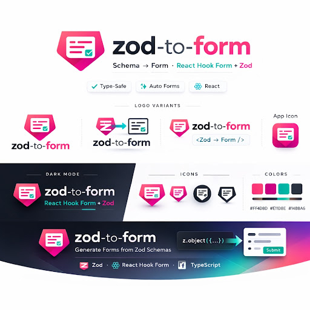

<p align="center">
  
</p>

<h1 align="center">zod-to-form</h1>

<p align="center">
  <strong>Schema-driven form generation for Zod v4.</strong><br>
  Walk a Zod schema once — render a validated form at runtime or generate a static, hand-readable <code>.tsx</code> component at build time.
</p>

<p align="center">
  
</p>

```tsx
import { ZodForm } from '@zod-to-form/react';

<ZodForm schema={userSchema} onSubmit={(data) => console.log(data)}>
  <button type="submit">Submit</button>
</ZodForm>
```

## Packages

| Package | Description |
|---|---|
| [`@zod-to-form/core`](packages/core) | Schema walker & processor registry — zero runtime deps |
| [`@zod-to-form/react`](packages/react) | `<ZodForm>` runtime renderer + shadcn/ui component map |
| [`@zod-to-form/cli`](packages/cli) | `zodform generate` CLI for static codegen |

## Installation

```bash
# Runtime rendering
pnpm add @zod-to-form/core @zod-to-form/react

# Peer dependencies (install in your project)
pnpm add zod react react-hook-form @hookform/resolvers

# CLI code generation (optional, dev dependency)
pnpm add -D @zod-to-form/cli
```

## Quick Start

### Runtime — `<ZodForm>`

```typescript
import { z } from 'zod';

const userSchema = z.object({
  name: z.string().min(2, 'Name must be at least 2 characters'),
  email: z.string().email('Invalid email address'),
  age: z.number().min(18).optional(),
  role: z.enum(['admin', 'editor', 'viewer']),
  bio: z.string().optional(),
  newsletter: z.boolean().default(false),
});
```

```tsx
import { ZodForm } from '@zod-to-form/react';

function App() {
  return (
    <ZodForm
      schema={userSchema}
      onSubmit={(data) => console.log(data)} // typed as z.infer<typeof userSchema>
    >
      <button type="submit">Create User</button>
    </ZodForm>
  );
}
```

Renders a complete form with correct input types, labels derived from field names, and validation errors from the Zod schema — no manual wiring required.

### Metadata Annotations

Control rendering via Zod v4's native registry API:

```typescript
const formRegistry = z.registry<{
  fieldType?: string;
  order?: number;
  hidden?: boolean;
}>();

const schema = z.object({
  name: z.string().meta({ title: 'Full Name' }),
  email: z.string().email().meta({ examples: ['alice@example.com'] }),
  bio: z.string().optional(),
});

formRegistry.register(schema.shape.bio, { fieldType: 'textarea' });
```

```tsx
<ZodForm schema={schema} formRegistry={formRegistry} onSubmit={handleSubmit}>
  <button type="submit">Save</button>
</ZodForm>
```

### shadcn/ui Components

```tsx
import { ZodForm } from '@zod-to-form/react';
import { shadcnComponentMap } from '@zod-to-form/react/shadcn';

<ZodForm schema={schema} components={shadcnComponentMap} onSubmit={handleSubmit}>
  <button type="submit">Save</button>
</ZodForm>
```

### CLI Code Generation

Generate a static, zero-dependency `.tsx` form component:

```bash
npx zodform generate \
  --schema src/schemas/user.ts \
  --export userSchema \
  --out src/components/ \
  --name UserForm
```

Generates `src/components/UserForm.tsx` — reads like hand-written code, imports only from `react-hook-form` and your UI library, compiles in strict mode.

**With Next.js server action:**

```bash
npx zodform generate --schema src/schemas/user.ts --export userSchema --server-action
```

**Watch mode:**

```bash
npx zodform generate --schema src/schemas/user.ts --export userSchema --watch
```

### Nested Objects and Arrays

```typescript
const orderSchema = z.object({
  customer: z.object({
    name: z.string(),
    email: z.string().email(),
  }),
  items: z.array(
    z.object({ product: z.string(), quantity: z.number().min(1) })
  ).min(1),
});
```

Renders a `customer` fieldset group and an `items` repeater with add/remove controls. Remove is disabled when the minimum count is reached.

### Discriminated Unions

```typescript
const paymentSchema = z.discriminatedUnion('type', [
  z.object({ type: z.literal('credit_card'), cardNumber: z.string() }),
  z.object({ type: z.literal('paypal'), email: z.string().email() }),
]);
```

Renders a select for `type`, then reveals only the fields for the selected variant.

## Supported Zod Types

`string` · `number` · `boolean` · `date` · `enum` · `literal` · `file` · `object` · `array` · `tuple` · `union` · `discriminatedUnion` · `intersection` · `nullable` · `optional` · `default` · `pipe` · `readonly` · `lazy` (cycle-safe)

## Architecture

```
@zod-to-form/core     schema._zod.def → FormField[]   (zero deps, Zod peer)
@zod-to-form/react    FormField[] → <ZodForm>          (React + RHF peers)
@zod-to-form/cli      FormField[] → UserForm.tsx       (static codegen, no runtime dep)
```

The core walker dispatches by `def.type` to a processor registry. Each processor reads `schema._zod.def` for structure and `schema._zod.bag` for constraint data, writing into a `FormField` descriptor. The same `FormField[]` tree drives both the runtime renderer and the CLI codegen — ensuring identical behavior (SC-003).

## Custom Processors

You can import built-in processors from the public entrypoint and override specific schema types.

```typescript
import { z } from 'zod';
import { walkSchema } from '@zod-to-form/core';
import { processString } from '@zod-to-form/core/processors';
import type { FormProcessor } from '@zod-to-form/core';

const uppercaseStringProcessor: FormProcessor = (schema, ctx, field, params) => {
  processString(schema, ctx, field, params);
  field.component = 'Input';
  field.props['textTransform'] = 'uppercase';
};

const schema = z.object({
  name: z.string().min(1)
});

const fields = walkSchema(schema, {
  processors: {
    string: uppercaseStringProcessor
  }
});
```

You can also annotate specific fields through a `ZodFormRegistry` and combine that metadata with processors.

```typescript
import { z } from 'zod';
import { walkSchema, type FormMeta } from '@zod-to-form/core';

const formRegistry = z.registry<FormMeta>();

const schema = z.object({
  title: z.string(),
  superType: z.string()
});

formRegistry.add(schema.shape.title, {
  fieldType: 'textarea',
  order: 1
});

formRegistry.add(schema.shape.superType, {
  fieldType: 'cross-ref',
  props: { refType: 'Data' }
});

const fields = walkSchema(schema, { formRegistry });
```

## Development

```bash
pnpm install        # Install dependencies
pnpm test           # Run all tests (110 tests across 3 packages)
pnpm run type-check # TypeScript strict mode check
pnpm run lint       # oxlint
pnpm run build      # Build all packages
pnpm run format     # oxfmt
```

## Project Structure

```
packages/
├── core/    # @zod-to-form/core  — schema walker & processors
├── react/   # @zod-to-form/react — <ZodForm> runtime renderer
└── cli/     # @zod-to-form/cli   — zodform generate CLI
specs/
└── 001-zodform/  # Feature spec, plan, tasks, contracts
docs/
└── DEVELOPMENT.md · TESTING.md · WORKSPACE.md
```

## Documentation

- [Development Workflow](docs/DEVELOPMENT.md)
- [Testing Guide](docs/TESTING.md)
- [Workspace Guide](docs/WORKSPACE.md)
- [Feature Spec](specs/001-zodform/spec.md)
- [Quickstart](specs/001-zodform/quickstart.md)

## Contributing

See [CONTRIBUTING.md](CONTRIBUTING.md) for guidelines.

## License

MIT — see [LICENSE](LICENSE) for details.

---

**Author**: Pradeep Mouli · **Version**: 0.2.0 · **Zod**: v4.x only
